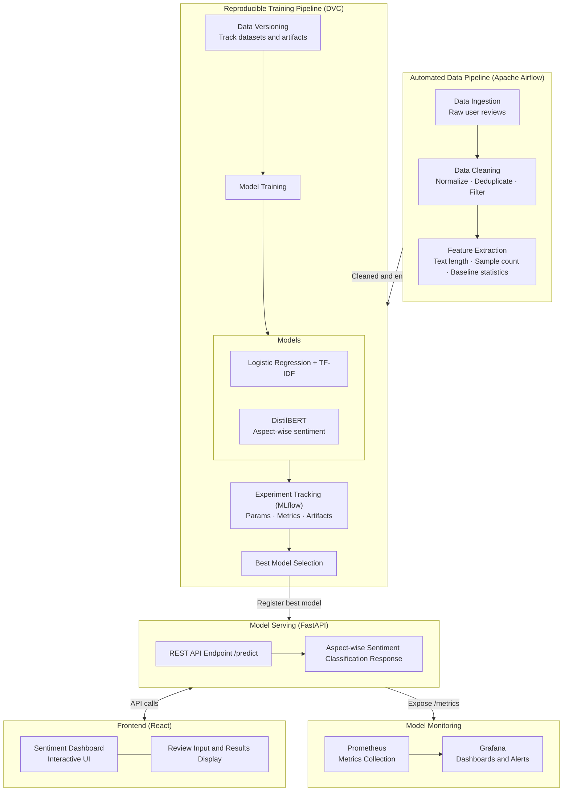

# Product Sentiment Dashboard — System Workflow

```mermaid
flowchart TD
    subgraph PIPELINE["Automated Data Pipeline (Apache Airflow)"]
        direction TB
        A1["Data Ingestion\nRaw user reviews"]
        A2["Data Cleaning\nNormalize · Deduplicate · Filter"]
        A3["Feature Extraction\nText length · Sample count · Baseline statistics"]
        A1 --> A2 --> A3
    end

    subgraph DVC["Reproducible Training Pipeline (DVC)"]
        direction TB
        B1["Data Versioning\nTrack datasets and artifacts"]
        B2["Model Training"]

        subgraph MODELS["Models"]
            direction LR
            M1["Logistic Regression + TF-IDF"]
            M2["DistilBERT\nAspect-wise sentiment"]
        end

        B3["Experiment Tracking (MLflow)\nParams · Metrics · Artifacts"]
        B4["Best Model Selection"]

        B1 --> B2
        B2 --> MODELS
        MODELS --> B3
        B3 --> B4
    end

    subgraph SERVING["Model Serving (FastAPI)"]
        C1["REST API Endpoint /predict"]
        C2["Aspect-wise Sentiment Classification Response"]
        C1 --> C2
    end

    subgraph UI["Frontend (React)"]
        D1["Sentiment Dashboard\nInteractive UI"]
        D2["Review Input and Results Display"]
        D1 --- D2
    end

    subgraph MONITORING["Model Monitoring"]
        direction LR
        E1["Prometheus\nMetrics Collection"]
        E2["Grafana\nDashboards and Alerts"]
        E1 --> E2
    end

    PIPELINE -->|"Cleaned and enriched data"| DVC
    B4       -->|"Register best model"| SERVING
    SERVING  <-->|"API calls"| UI
    SERVING  -->|"Expose /metrics"| MONITORING
```
